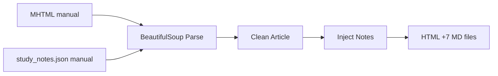
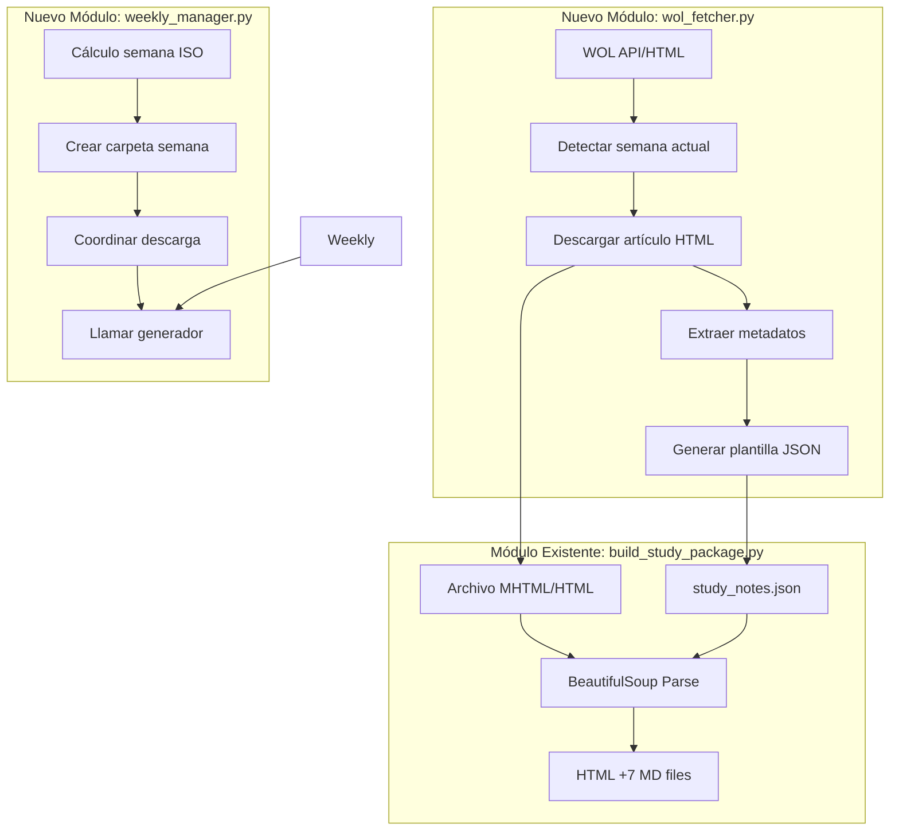
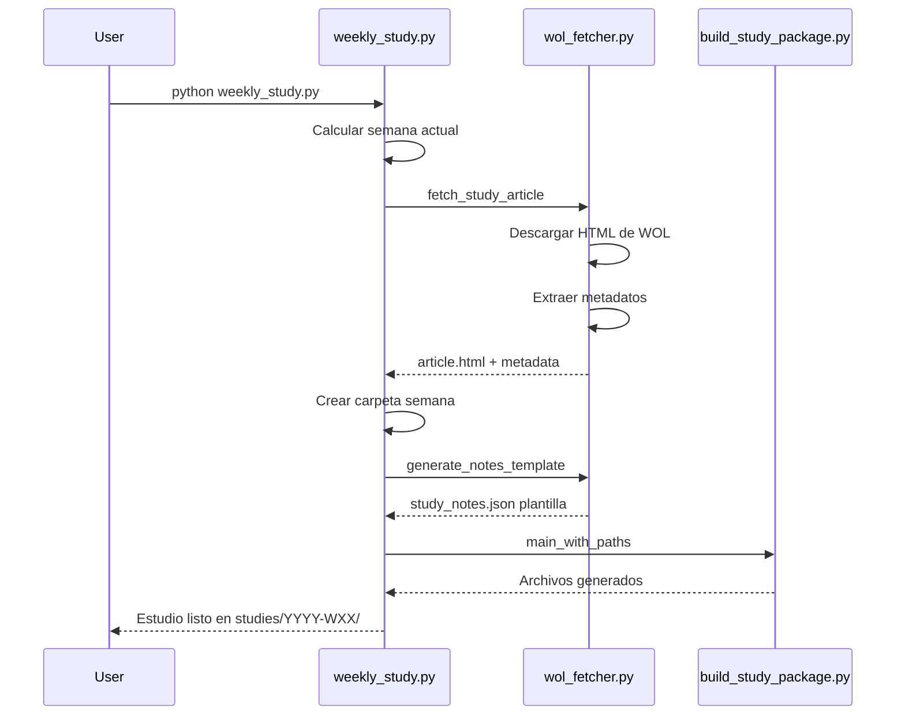

# Plan: Extensión para Generación Semanal Automática

## Resumen

Extender `build_study_package.py` para:
1. Descargar automáticamente el artículo de La Atalaya de la semana actual desde WOL
2. Generar plantilla `study_notes.json` con metadatos extraídos del artículo
3. Organizar salida en carpetas por semana (ej: `studies/2026-W12/`)

---

## Arquitectura Actual



## Arquitectura Propuesta



---

## Componentes Nuevos

### 1. `wol_fetcher.py` - Descarga de Artículos WOL

**Funciones principales:**

| Función | Descripción |
|---------|-------------|
| `get_current_week_info()` | Calcula semana ISO actual y rango de fechas |
| `fetch_study_article()` | Descarga HTML del artículo de estudio actual |
| `extract_article_metadata()` | Extrae título, URL, canciones, texto temático |
| `generate_notes_template()` | Crea plantilla JSON con estructura vacía |

**URLs WOL conocidas:**
- Artículo de estudio: `https://wol.jw.org/es/wol/d/r4/lp-s/{year}{week}`
- Patrones detectados en `study_notes.json`: `/es/wol/d/r4/lp-s/2026243`

**Estrategia de descarga:**
1. Calcular número de semana ISO actual
2. Construir URL del artículo (formato: `{year}{week_number}`)
3. Descargar HTML con `urllib.request`
4. Parsear con BeautifulSoup para extraer metadatos

### 2. `weekly_manager.py` - Gestión Semanal

**Funciones principales:**

| Función | Descripción |
|---------|-------------|
| `get_week_folder()` | Retorna ruta `studies/{year}-W{week}` |
| `setup_week_folder()` | Crea estructura de carpetas |
| `run_weekly_generation()` | Orquesta todo el proceso |

**Estructura de carpetas:**
```
studies/
├── 2026-W11/
│   ├── study_notes.json
│   ├── article.mhtml
│   ├── {slug}-estudio.html
│   ├── 00-articulo-fuente.md
│   ├── 01-guia-conduccion.md
│   └── ...
├── 2026-W12/
│   └── ...
└── index.json  # Índice de estudios generados
```

### 3. Modificaciones a `build_study_package.py`

**Cambios necesarios:**

1. **Soporte para rutas dinámicas:**
   - `ROOT` debe ser configurable via parámetro
   - `OUTPUT_FILES` debe aceptar directorio de salida

2. **Nueva función `main_with_paths()`:**
```python
def main_with_paths(source_path: Path, notes_path: Path, output_dir: Path) -> None:
    # Configurar rutas dinámicamente
    # Ejecutar pipeline existente
```

3. **Detección de formato de entrada:**
   - Actual: solo MHTML
   - Nuevo: MHTML o HTML directo desde WOL

---

## Estructura de Plantilla JSON

```json
{
  "meta": {
    "title": "{extraído del artículo}",
    "article_url": "{url de WOL}",
    "date_range": "{calculado desde semana ISO}",
    "opening_song": "{extraído si disponible}",
    "closing_song": "{extraído si disponible}",
    "theme_scripture": "{extraído del artículo}",
    "theme": "",
    "summary_points": [],
    "opening_questions": []
  },
  "timing": {
    "default_start": "{calculado: lunes de la semana}",
    "total_minutes": 60,
    "intro_minutes": 1.5,
    "closing_minutes": 1.0,
    "blocks": []
  },
  "paragraphs": [
    {
      "study_number": 1,
      "timing_minutes": 3.0,
      "kind": "introductorio",
      "highlight": {...},
      "extra_question": ""
    }
  ],
  "terms": [],
  "threads": [],
  "applications": [],
  "comment_prompts": []
}
```

---

## Flujo de Ejecución

### Comando Principal

```bash
# Generar estudio de la semana actual
python weekly_study.py

# Generar estudio de una semana específica
python weekly_study.py --week 2026-W12

# Solo descargar artículo sin generar
python weekly_study.py --download-only

# Regenerar desde plantilla existente
python weekly_study.py --regenerate --week 2026-W12
```

### Proceso



---

## Lista de Tareas de Implementación

### Fase 1: Infraestructura base
- [ ] Crear archivo `wol_fetcher.py` con estructura de módulo
- [ ] Implementar `get_current_week_info()` con cálculo ISO
- [ ] Implementar `fetch_study_article()` con descarga HTTP
- [ ] Implementar `extract_article_metadata()` con BeautifulSoup

### Fase 2: Plantillas y gestión
- [ ] Implementar `generate_notes_template()` con estructura JSON
- [ ] Crear `weekly_manager.py` con gestión de carpetas
- [ ] Implementar `get_week_folder()` y `setup_week_folder()`
- [ ] Crear `index.json` para tracking de estudios

### Fase 3: Integración
- [ ] Modificar `build_study_package.py` para rutas dinámicas
- [ ] Crear `weekly_study.py` como punto de entrada
- [ ] Implementar argumentos de línea de comandos
- [ ] Manejar formato HTML además de MHTML

### Fase 4: Pruebas y refinamiento
- [ ] Probar descarga con artículos reales de WOL
- [ ] Validar estructura de plantillas generadas
- [ ] Probar regeneración desde plantillas editadas
- [ ] Documentar uso en README

---

## Consideraciones Técnicas

### Detección de Artículo Actual

WOL usa un formato de URL como `/es/wol/d/r4/lp-s/2026243` donde:
- `2026` = año
- `243` = parece ser un identificador del artículo

**Alternativa más confiable:**
1. Usar la página de La Atalaya: `https://wol.jw.org/es/wol/library/r4/lp-s/all-publications/watchtower`
2. Parsear el listado para encontrar el artículo de la semana actual
3. Extraer URL del artículo correspondiente

### Manejo de Errores

- Sin conexión: usar caché local si existe
- Artículo no encontrado: reportar error con URL intentada
- Plantilla incompleta: generar con campos vacíos, permitir edición manual

### Compatibilidad

- Mantener funcionamiento actual de `build_study_package.py`
- Nuevos módulos son opcionales
- Formato `study_notes.json` sin cambios
